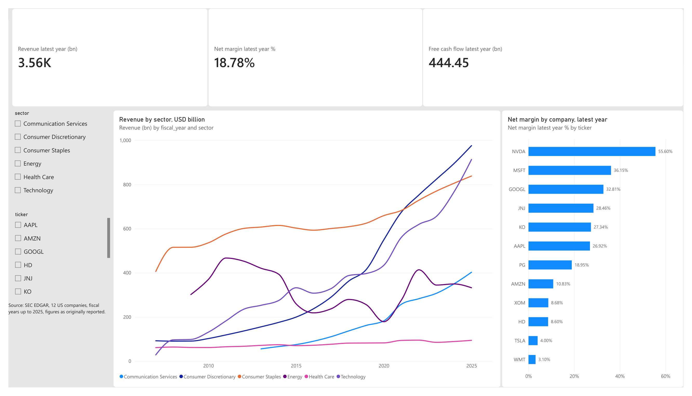

# SEC financials in PostgreSQL

Annual financial statements of 12 large US companies, loaded from SEC EDGAR into PostgreSQL. The project covers the load and clean steps in Python, the data model and KPI views in SQL, automated data quality checks, and a set of analysis queries.

**What is in the database:** 12 companies, 11 metrics (revenue, net income, total assets and others), fiscal years 2007 to 2026, 2,136 annual figures built from 26,543 raw reported facts.

## Why this project

A finance team gets figures from filings that use different tags, restate earlier years and report the same number in several places. Before any KPI is trustworthy, someone has to decide which figure to use and check the result. This project does that in SQL and documents each decision.

## Data

[SEC EDGAR company facts](https://www.sec.gov/search-filings/edgar-application-programming-interfaces) (XBRL), public data. One JSON file per company, downloaded by `src/fetch_sec.py`. The raw files are not committed. Run the pipeline to download them.

Companies: AAPL, MSFT, NVDA, GOOGL, AMZN, TSLA, HD, PG, KO, WMT, JNJ, XOM. Banks and insurers are left out on purpose, because their statements use different line items. Sectors are a rough label I assigned, not an SEC field.

## How it works

```
SEC JSON  ->  raw.facts  ->  core.fact_annual  ->  mart views  ->  analysis queries
(Python)      (as loaded)    (cleaned, SQL)        (KPIs, SQL)      dq checks
```

| Step | File | What it does |
|---|---|---|
| Download | `src/fetch_sec.py` | Gets the company facts files |
| Load | `src/load_raw.py` | Keeps 17 us-gaap tags and loads them into `raw.facts` |
| Schema | `sql/01_schema.sql` | Schemas `raw`, `core`, `mart`, `dq` and their tables |
| Transform | `sql/02_transform.sql` | Builds `core.fact_annual`: one value per company, metric and year |
| KPIs | `sql/03_kpis.sql` | Views with margins, growth, ROE, free cash flow, rankings |
| Checks | `sql/04_checks.sql` | 10 data quality checks, results stored in `dq.check_results` |
| Analysis | `sql/05_analysis_queries.sql` | 12 questions answered with joins, CTEs and window functions |

### Cleaning decisions (in `sql/02_transform.sql`)

- Only annual figures from 10-K filings in USD. Income and cash flow items must cover 350 to 380 days. Balance sheet items must fall on the end of an annual period in the same filing.
- Companies label revenue with different tags, and some changed tags over time. A priority list picks one per year (for example Apple used `SalesRevenueNet`, then `Revenues`, then `RevenueFromContractWithCustomerExcludingAssessedTax`).
- Figures are **as originally reported**: the first 10-K that reports a period. Every number of one year then comes from the same filing, so the balance sheet balances.
- `fiscal_year` is the calendar year in which most of the fiscal year falls. A year ending in January (Walmart, Home Depot, Nvidia) belongs to the previous calendar year. Walmart calls the year ending January 2026 "fiscal 2026", here it is 2025.

## Data quality checks

`select * from dq.latest_checks;` shows the latest run. All 10 checks pass on the current data. Examples: total assets equal liabilities plus equity, no gaps in the revenue history, revenue never changes by more than -40% or +150% in a year without a review note.

The checks found real problems while I built this, and I fixed the cause each time:

| Check result | Cause | Fix |
|---|---|---|
| Walmart FY2013: assets did not equal liabilities plus equity | Taking the latest restated value per metric mixed two filings | Use as-originally-reported figures from one filing |
| Walmart had two period ends in one year | A cash figure dated 31 Dec 2012 in the notes, not a fiscal year end | Balance sheet dates must match an annual period end |
| J&J 2007 to 2008 had revenue but no net income | J&J used the tag `ProfitLoss` in those years | Added `ProfitLoss` as a fallback tag |
| P&G FY2014 revenue showed 29.4 billion USD (-65%) | The filing also tags a part of revenue as `Revenues` | Ignore a revenue tag below half of the largest revenue figure in the same filing |
| Tesla 2013 revenue growth +387% | Real. Revenue was 413 million USD in 2012 and 2,013 million USD in 2013 | Recorded in `dq.reviewed_exceptions` with the reason |

## Example results

Full output for all 12 queries is in [`docs/query_results.txt`](docs/query_results.txt). A few lines (fiscal 2025, the latest year all companies have reported):

- Highest revenue: Amazon 716.9 billion USD, Walmart 706.4, Apple 416.2.
- Median net margin by sector: Technology 36.1%, Communication Services 32.8%, Health Care 28.5%, Consumer Staples 19.0%, Energy 8.7%, Consumer Discretionary 8.6%. Most sectors have only one to three companies here, so these are not sector averages.
- Home Depot's return on equity reaches 1,450% in 2023 because its equity is very small after share buybacks. High ROE here comes from leverage, not only profit.

## Power BI report



Report file: [`powerbi/sec_financials.pbix`](powerbi/sec_financials.pbix). Page 1 shows the latest common year (2025): total revenue, net margin and free cash flow of the selected companies, revenue by sector since 2007, and net margin by company. Slicers filter by sector and ticker. Page 2 lists the 10 data quality checks.

- Data: [`powerbi/data/sec_financials.xlsx`](powerbi/data/sec_financials.xlsx), an export of `mart.kpis_annual` and `dq.latest_checks`. Re-export it after a new pipeline run.
- 13 DAX measures in [`powerbi/measures.dax`](powerbi/measures.dax). Ratios use SUM divided by SUM, so a selection of several companies gives a weighted figure.
- The report is limited to fiscal years up to 2025, because not every company has reported 2026 yet.
- I checked the numbers on page 1 against the database: all 12 net margins and the three totals match.

## Limits

- 12 large companies is a small sample. Nothing here says how the whole market behaves.
- As-originally-reported figures are not restated. Growth between two years can include the effect of an acquisition or a divestiture. For example P&G's FY2016 revenue change of -14.4% reflects brands that were sold, not only weaker sales.
- Revenue tags are not identical across companies. Walmart's total revenues (`Revenues`) are about 1% higher than the figure used here (revenue from contracts with customers).
- Not every company reports every item. P&G, Walmart, Alphabet and Exxon have no gross profit, and Amazon has it for only 3 years. Nvidia's capex is only available for 8 years. Revenue history starts in 2009 for Exxon and 2013 for Alphabet.
- Capex tags differ by company, so free cash flow is an approximation.

## Run it

Requires Python 3.11+ and PostgreSQL.

```bash
git clone https://github.com/muskan688/sec-financials-sql.git
cd sec-financials-sql
python -m pip install -r requirements.txt
cp .env.example .env        # then set DATABASE_URL and SEC_USER_AGENT
```

Create an empty database (for example `sec_financials`), then:

```bash
python -m src.pipeline       # download, load, transform, build views, run checks
python -m src.run_queries    # print the analysis queries
python -m pytest             # unit tests
```

## Structure

```
sql/        schema, transform, KPI views, checks, analysis queries
src/        download, load, pipeline runner, query runner
tests/      unit tests for parsing and query splitting
docs/       saved query results
```

## Next steps

- A Power BI page with company drill-down.
- Quarterly figures from 10-Q filings.
- Restated figures next to the as-reported ones.
